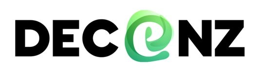

# DECENZ

  

Un groupement d’entreprises françaises du numérique qui se font confiance pour bâtir des communs utiles, souverains, éthiques et responsables​

  <table style="border-collapse: collapse; border: none;">
    <tr>
      <td style="text-align: center; vertical-align: middle; border: none; padding: 0 10px;">
        
      </td>
      <td style="text-align: center; vertical-align: middle; border: none; padding: 0 10px;">
        
      </td>
      <td style="text-align: center; vertical-align: middle; border: none; padding: 0 10px;">
        
      </td>
      <td style="text-align: center; vertical-align: middle; border: none; padding: 0 10px;">
        
      </td>
      <td style="text-align: center; vertical-align: middle; border: none; padding: 0 10px;">
        
      </td>
    </tr>
  </table>

Nos premiers communs : 
- https://www.climateqa.com/
- https://monacvnumerique.fr/
- https://www.davidson.fr/manifeste-pour-lecoconception-des-services-numeriques/
